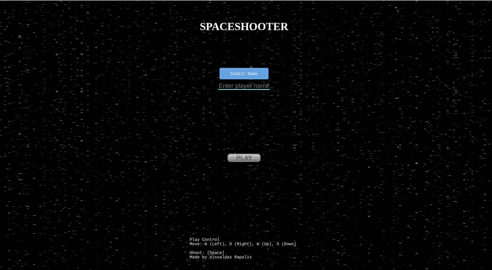
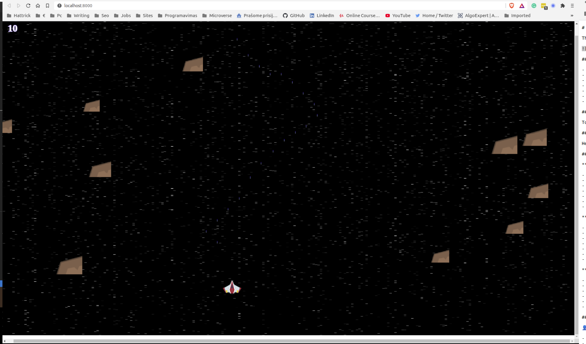
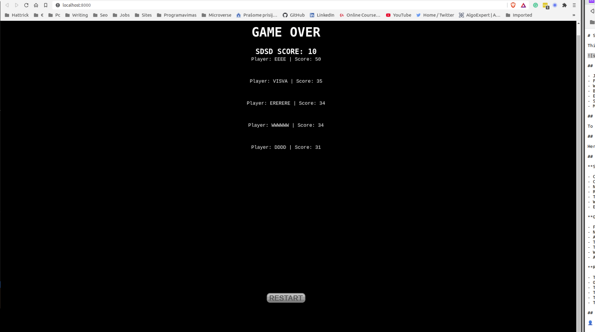

# Shooter Game

JavaScript, Phaser 3 project, the goal of this project was to build a space shooter game that can be played on the browser and stores your score on an online server

## Play the game
[Link](https://rawcdn.githack.com/visva-dev/Shooter-Game/b8b3964a3785dcd56a5cf9b12fba6497ac6430bc/index.html)

## Built with:

*   HTML 
*   Phaser3
*   Webpack
*   Javascript
*   Eslint
*   Babel
*   Jest
*   [Netlify](https://www.netlify.com/) for deployment
*   [Leaderboard API service](https://www.notion.so/Leaderboard-API-service-24c0c3c116974ac49488d4eb0267ade3) for high scores

## Getting Started

>Clone the repository
```
- git clone https://github.com/visva-dev/Shooter-Game.git;
- cd Shooter-Game/
```
>Install the dependencies
```
npm install
```
>Start the server
```
npm start
```
> Open up your browser and navigate to http://localhost:8080/ and start the game

>To run the unit tests
```
npm run test
```
## How to Play
+ MOVE UP: Press [W] key
+ MOVE DOWN: Press [S] key
+ MOVE LEFT: Press [A] key
+ MOVE RIGHT: Press [D] key
+ SHOOT LASER: Press [SPACEBAR] key

## About the game
The player needs to destroy the rocks and avoid them at the same time,
By destroying the rocks player acquiring points. 
The goal is to acquire as many points as you can and become the best on the leaderboard.

## Screenshots
<br>
<br>


### Game Design & Development
- In order to get started with the game, I had to start by going through a tutorial on how to use Phaser [here](http://phaser.io/tutorials/making-your-first-phaser-3-game). This alongside the phaser documentation and examples provided the basic knowledge.
#### Design
- Next up, I came up with a concept theme to work with and the storyline for the flow of the game. This includes the scene background and sprites for the character and the sound effects to be used. The storyline controlled the spawing of the enemies at different set times. Different capabilities for the player and enemies were proposed for implementation.

#### Assets
- With the game design in mind, I went to opengameart to find the right assets that would bring my game to life. 

#### Development
- Now that everything that I needed was in my asset folder, I proceeded to plan how the game would come together with the different characters. First I set up the player character, made him move and able to fire. Next came the enemy characters and their traits as well. A few extra features were left out for future development but the core requirements were met.
Having implemented their core features, I went on to add more scenes for navigating the game and then wrote some tests to ensure things were working as they should.
- The last thing was separating the code into modules for readability and easier maintenance.

## Author

👤 **Visvaldas Rapalis**

- Github: [@visva-dev](https://github.com/visva-dev)
- Twitter: [@Visva_Dev](https://twitter.com/Visva_Dev)
- Linkedin: [@Visvaldas-Rapalis](https://www.linkedin.com/in/visvaldas-rapalis/)
- Website: [good-developer.com](https://good-developer.com)

## 🤝 Contributing

Contributions, issues and feature requests are welcome!

Feel free to check the [issues page](https://github.com/paulzay/shooter/issues)

## Future features
- More scenes and stages
- Power-ups
- Different player characters to choose from

## Show your support

Give a ⭐️ if you like this project!

## Acknowledgments

- All the resources used are open source and can be found on [gameart](https://gameart.org/)

## 📝 License

This project is free to use as learning purposes. For any external content (e.g. logo, images, ...), please contact the proper author and check their license of use.